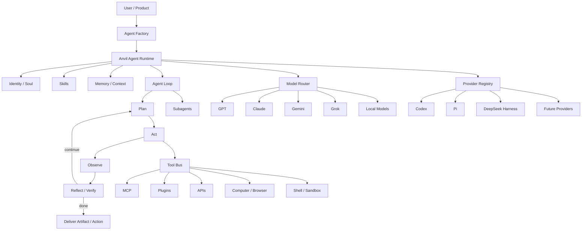

# Anvil · Agent Runtime Architecture

> Status: CORE foundation
> Principle: provider-agnostic, model-agnostic, tool-agnostic.

## 1. Product position

Anvil is the group's Agent Runtime and orchestration foundation. It is not a chat shell and not a vendor-specific wrapper.

Anvil owns:
- Agent identity and execution contract
- Agent loop / planning / acting / observing / reflection
- Skill loading and routing
- Tool / MCP / plugin dispatch
- Memory and project context boundaries
- Provider adapters and routing
- Runtime / sandbox / computer execution interfaces
- Artifact and action delivery
- Permissions, approvals and audit events

External models and products are providers or benchmarks, never the product core.

## 2. Reference systems to absorb

We study architecture patterns rather than copy products.

- Grok Build: agent loop, context assembly, tool dispatch, skills, plugins, hooks, MCP, subagents, local-first harness patterns.
- Claude / Claude Code: project instructions, CLAUDE.md-style context, skills, MCP, permissions, coding-agent workflow.
- ChatGPT: plugin packaging, reusable agent capabilities, connected tools/workspaces, artifact-oriented workflows.
- Gemini: computer-use and multimodal action patterns.
- Manus: long-running execution, cloud-computer style runtime, artifact-first completion.

## 3. Target architecture



## 4. Runtime layers

### L0 · Protocol
Stable contracts for Agent, Skill, Tool, Provider, Memory and Artifact.

### L1 · Harness
The deterministic runtime responsible for lifecycle, context assembly, tool calls, retries, approvals and completion checks.

### L2 · Providers
Adapters for models, coding agents, browsers, runtimes and third-party services.

### L3 · Skills
Reusable domain capability packages. Skills must not assume a specific LLM unless unavoidable.

### L4 · Agent Factory
Builds packaged AI employees from identity + skills + tools + memory + permissions + commercial policy.

### L5 · Vertical Agents
Creator, Wedding Growth, PM, Director, Sales, Research and future domain employees.

## 5. Non-negotiable rules

1. No vendor may be imported directly into product UI business logic.
2. Every external capability enters through a typed adapter.
3. Model routing must be separable from workflow logic.
4. Skills are reusable assets, not prompt fragments scattered in code.
5. Project instructions must have a stable top-level context contract.
6. Every agent run emits inspectable events and a final artifact/action result.
7. Expensive or irreversible actions require explicit permission policy.
8. A provider can be removed without rewriting the product.
9. UI never defines the core architecture; runtime contracts do.
10. Current implementation stays small while interfaces preserve the end-state architecture.

## 6. Initial execution loop

```text
request
  -> resolve agent
  -> assemble context
  -> select model/provider
  -> plan
  -> execute tool/skill
  -> observe result
  -> verify against DoD
  -> retry / delegate / ask approval when needed
  -> deliver artifact/action
  -> persist run summary + reusable memory
```

## 7. First commercial implication

The runtime should make it possible to package a vertical AI employee without forking the engine.

Example package:

```yaml
agent:
  id: wedding-growth-director
  role: 婚礼增长总监
  skills:
    - competitor-research
    - topic-mining
    - script-writing
    - sales-followup
  tools:
    - web
    - files
    - spreadsheet
  permissions:
    external_write: approval_required
    spending: denied
  model_policy:
    route: auto
  deliverables:
    - weekly-topic-plan
    - scripts
    - sales-actions
```

The same runtime must support different vertical employees by changing package configuration and skills, not runtime code.
