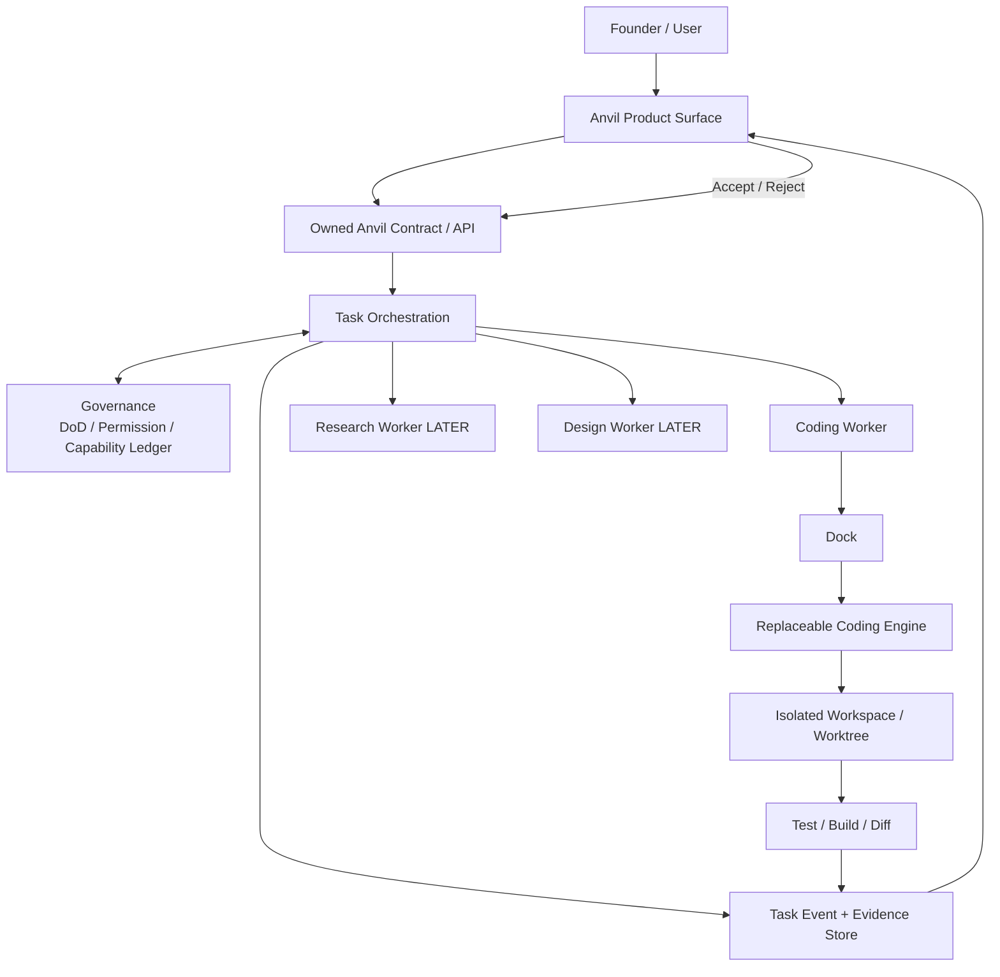
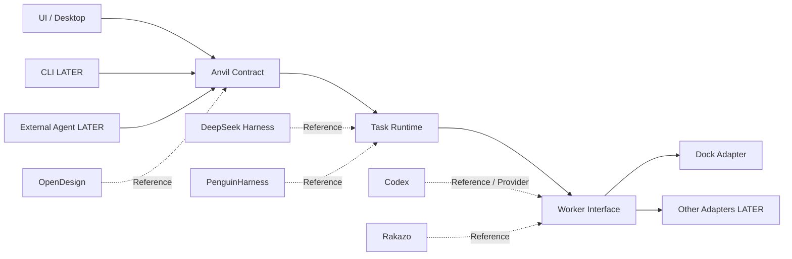
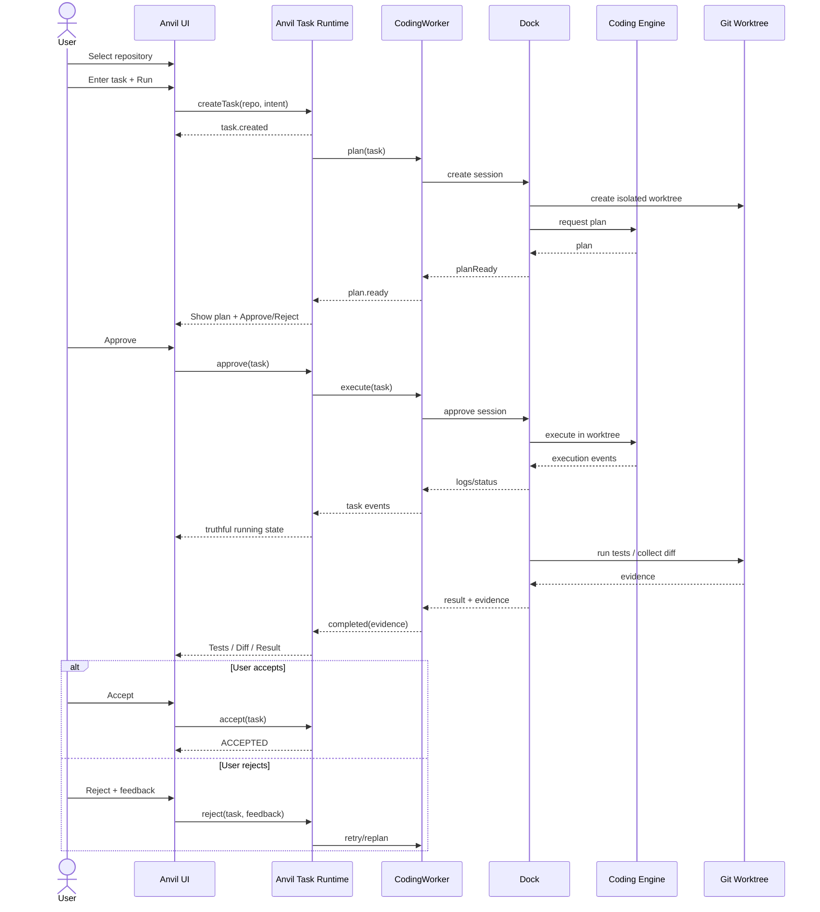
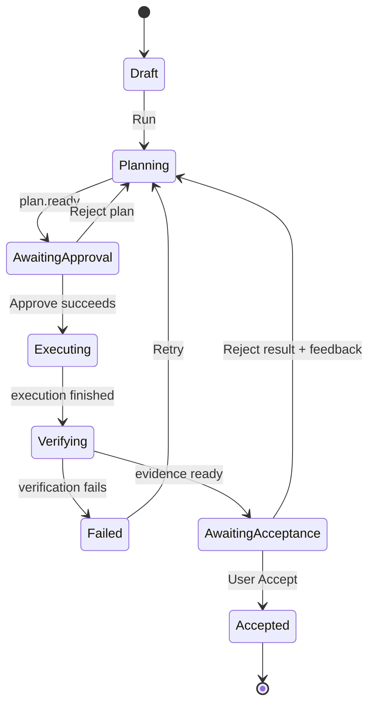
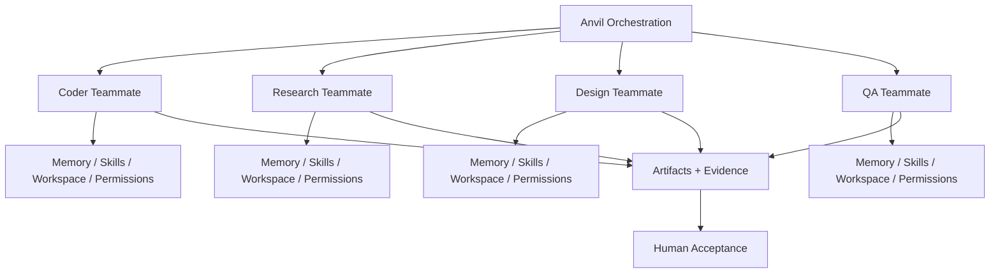

# Anvil Architecture & Sequence Diagrams

Status: Frozen direction; implementation grows only after capability acceptance.

## 1. Product architecture

## 2. Dependency direction

Dashed arrows are research influence, not runtime dependency.

## 3. VS-001 sequence

## 4. Product state machine

Important: UI must never transition to `Executing` before backend approval succeeds.

## 5. Future teammate model

This diagram is NORTH STAR / LATER, not VS-001 scope.
