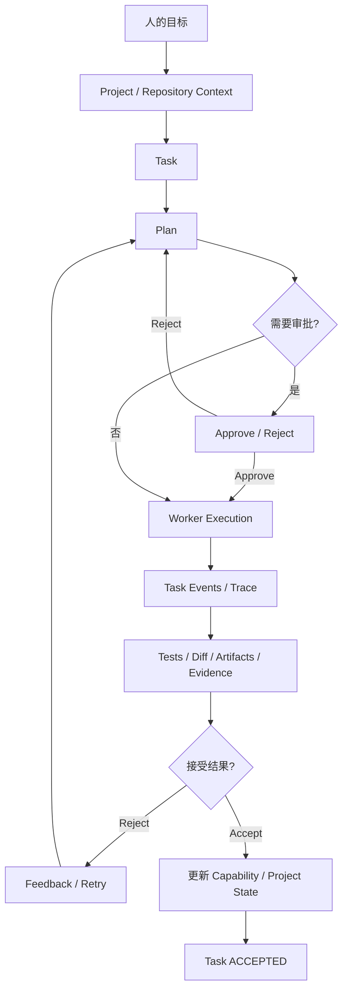
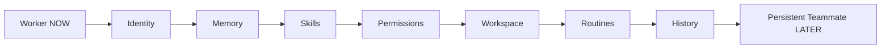

# Anvil PRD v3 — Accepted Work

Status: Rescue / Product Definition Frozen

## 产品定义

**Anvil 是从“我想完成一件事”到“这件事经过验证真的完成”的 AI 执行与治理系统。**

Anvil 不是聊天软件、模型管理器、本机 AI 软件集合、Codex 套壳、DeepSeek Harness GUI，也不负责把 Founder 电脑里安装的所有工具暴露出来。

## 用户真正的问题

用户已经可以拥有很多强大的 AI Agent，但仍然需要亲自承担：选 Agent、反复解释项目上下文、监督执行、判断 README/代码是否等于真实完成、恢复中断任务、记住项目进度、检查测试/Diff/Artifact，以及最后决定结果是否接受。

Anvil 的工作是消除这层协调负担。

## 北极星指标

**Accepted Tasks（真正被用户验收完成的任务）**。

模型数量、Harness 数量、Token、Agent Loop 步数、集成数量、README 功能数量都不是北极星指标。

## 核心产品闭环



## 产品成熟度

### L1 Execute
Goal -> Task -> Worker -> Result -> Evidence -> Accept/Reject。

### L2 Continue
Project、Session、Checkpoint、Resume、Progress、Evidence 跨会话持续存在。

### L3 Coordinate
Anvil 在权限与预算约束下选择/委派可替换 Worker/Agent。

### L4 Govern Projects
Anvil 理解 Master Task、Capability Ledger、项目规则、DoD、Regression 和剩余任务，并能持续推进，而不是依赖用户反复输入“继续/推进”。

### L5 Improve
历史 Trace、成功/失败、Accept/Reject 形成 Evaluation Data，逐渐优化 Worker / Skill / Routing。自进化不是 MVP 功能。

## VS-001：第一个证明

用户打开 Anvil，选择 Repository，用自然语言描述一个 Coding Task，运行后看到真实执行状态，检查 Evidence，并 Accept / Reject。

`Launch -> Repository -> Task -> Run -> Plan/Status -> Approve -> Worker -> Test/Diff -> Accept/Reject`

VS-001 只证明 L1，不实现终局。

## Worker -> Teammate

NOW 只冻结最小 Worker Contract：

```ts
interface Worker {
  id: string
  capabilities: string[]
  execute(task: Task): AsyncIterable<TaskEvent>
}
```

未来 Persistent Teammate 可以增加 identity、role、memory、skills、permissions、workspace、routines、history、budget、status，但 VS-001 不实现。



## 外部参考资产

- OpenDesign：研究 Artifact-first、统一 Contract/API、Project Workspace、Skill/Plugin portability。
- Rakazo：研究 Persistent Teammate、Memory、Workspace、Routine、Permission、Delegation。
- DeepSeek Harness：研究 Kernel / Plugin / Loop。
- Codex：研究 Execution / Sandbox / Session / Resume / Tools / Evidence。
- PenguinHarness：研究 Benchmark / Evaluation / Evolution / Trace。

全部属于 REFERENCE。Anvil 自己拥有 Contract、命名、依赖关系、实现和测试。

## 产品原则

1. UI 不决定产品；用户结果和 Product Contract 决定 UI。
2. Installed != Product Fit。
3. README != Reality。
4. Implemented != Done；Verified != Accepted。
5. 默认交互围绕 Work / Task，不围绕 Model / Chat。
6. 内部命令、端口、Provider、Harness 名称藏在产品边界之后。
7. 没有 Evidence，不允许声称完成。
8. 用户看到的关键状态必须等于后端真实状态。
9. Extend / Reuse before Rewrite；新基础设施必须经过 CTAB + Asset Gate。
10. VS-001 在 Kim Test 前保持克制。

## 产品 DoD

长期 DoD：用户表达一个有意义的目标后，Anvil 能跨会话/Worker 持续协调执行、保存项目状态、产生可检查证据、从失败中恢复，并且只有在用户明确 Accept 后关闭任务；用户不需要理解底层 Harness / Model / Tool 拓扑。

MVP DoD：VS-001 必须先 VERIFIED，再通过 Kim Test 进入 ACCEPTED。
