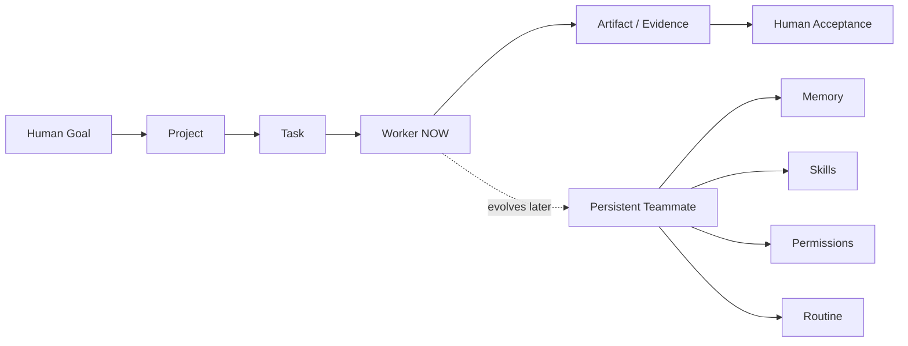

# Reference Patterns — OpenDesign & Rakazo

Purpose: capture product/architecture lessons without creating runtime dependencies or copying implementation structure.

## OpenDesign — what Anvil studies

### Adopt as principle
- Artifact-first: Agent work should end in inspectable deliverables/evidence, not only chat text.
- Shared contract: UI, future CLI and external agents should converge on one owned Anvil API/contract rather than duplicate business logic.
- Project workspace: execution is scoped to an explicit project/workspace.
- Portable skills/plugins: capabilities belong behind explicit contracts rather than being hard-coded into UI.

### Do not copy
- Product identity or UI layout.
- Internal API/file/class structure.
- Design-specific assumptions that do not serve Anvil's accepted-task loop.

## Rakazo — what Anvil studies

### Adopt as future capability model
- Persistent teammate identity.
- Memory and history.
- Skills/capabilities.
- Permissions and isolated workspace/computer.
- Routines / recurring autonomous work.
- Delegation and sub-agent/team patterns.

### Do not implement in VS-001
VS-001 needs a replaceable Worker, not a virtual AI company. Persistent teammate semantics are LATER and must be justified by accepted user workflows.

## Anvil synthesis

OpenDesign primarily informs the left-to-right delivery contract; Rakazo primarily informs the future evolution of Worker into persistent Teammate.

## Decision

- OpenDesign pattern study: NOW.
- Rakazo contract reservation: NOW.
- Rakazo-style persistent robot/team implementation: LATER.
- Runtime dependency on either project: REJECT for current architecture.
